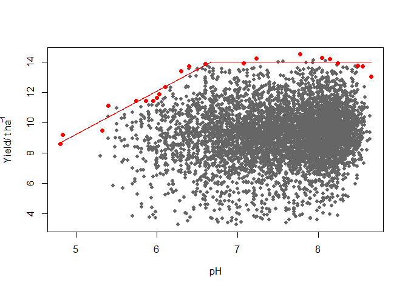

<!-- README.md is generated from README.Rmd. Please edit that file -->

# BLA

<!-- badges: start -->
<!-- badges: end -->

## Overview

The BLA `R` package provides a series of tools to fit boundary line
models to a data set as proposed by Webb (1972). It includes a suite of
methods which have been introduced since the original manually drawn
boundary lines were proposed. These include methods based on binning the
independent variable, the BOLIDES algorithm of Schug et al. (1995),
quantile regression and the censored bivariate normal model of Milne et
al. (2006). It also houses data exploration techniques to check for
outliers and to provide initial evidence for a limiting boundary in data
sets as an initial steps before doing boundary line analysis. It also
includes functions to determine suitable starting guess values for use
in fitting various boundary line models most of which use numerical
optimization procedures. Learn more in
`vignette("Introduction to boundary line analysis")`.

## How can I installation the package?

Install released version from CRAN:

``` r
install.packages("BLA")
```

## What can I use the BLA package for?

If you have data on pH and crop yield collected over several farms in a
non experimental survey (other factors not controlled), you can
determine the largest expected yields for a given pH value, also called
the boundary pH value. various methods to fit the boundary model
including the `blbin()`, `BOLIDES()`, `blqr()` and `cbvn()`. The example
below uses the `BOLIDES()` function:

``` r
library(BLA)
library(aplpack)

# 1. Outlier detection using bagplot() function
nobs<-length(soil$pH)
vals_ur<-matrix(NA,nobs,2)
vals_ur[,1]<-soil$pH 
vals_ur[,2]<-soil$yield

bag<-bagplot(vals_ur,create.plot = F )
vals<-rbind(bag$pxy.bag,bag$pxy.outer) # new excludes bivariate outliers

# 2. Fit the boundary model in form of a linear plateau ("lp")

x<-vals[,1]
y<-vals[,2]
theta =c(-12.99,2,13 ) # initial start values for optimisation

model<-BOLIDES(x,y, theta = theta,model = "lp",xlab=expression("pH"), 
        ylab=expression("Yield/ t ha"^-1), pch=16,
       col="grey40", cex=0.8)
```



``` r

model
#> $Model
#> [1] "lp"
#> 
#> $Equation
#> [1] y = min (β₁ + β₂x, β₀)
#> 
#> $Parameters
#>     Estimate
#> β₁ -4.981956
#> β₂  2.847364
#> β₀ 14.011192
#> 
#> $RMS
#> [1] 0.1733124
```

The boundary yield given the pH for each farm can be predicted:

``` r
pH_values<-soil$pH
pH_values[which(is.na(x)==T)]<-mean(x,na.rm=T)
predicted_yield<-predictBL(model,pH_values)

head(predicted_yield) # predicted yield for the first six fams
#> [1] 13.98149 14.01119 14.01119 13.07033 14.01119 13.63981
```

The critical pH value using the model parameters can be determined. This
is the pH beyond which yield increase response is not expected.

``` r
intercept<-model$Parameters[1]
slope<-model$Parameters[2]
plateau<-model$Parameters[3]

critical_pH<- (plateau-intercept)/slope

print(critical_pH)
#> [1] 6.670432
```

Other boundary line post-hoc analysis procedures can be conducted. For
more information, see the
`vignette("Introduction to boundary line analysis")` and
`vignette("Use of censored bivariate normal model function for yield gap analysis")`
