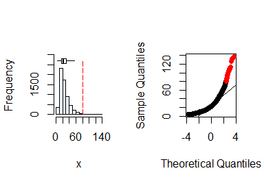
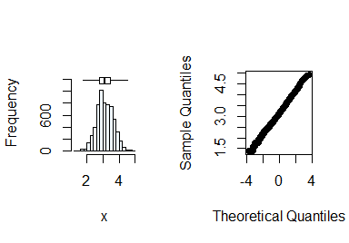
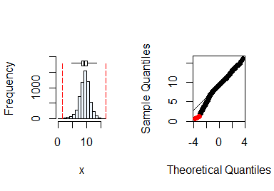
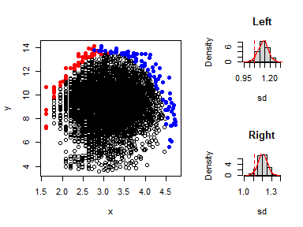
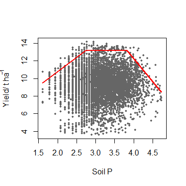

<!-- README.md is generated from README.Rmd. Please edit that file -->

# BLA

<!-- badges: start -->
<!-- badges: end -->

## Overview

The BLA `R` package provides a set of tools to fit boundary line models
to a data set as proposed by Webb (1972). It includes a suite of methods
which have been introduced since the original manually-drawn boundary
lines were proposed. These include methods based on binning the
independent variable, the BOLIDES algorithm of Schug *et al*. (1995),
quantile regression and the statistically robust censored bivariate
normal model of Milne *et al*. (2006). It also provides data exploration
methods to check for outliers and to provide initial evidence for a
limiting boundary in data sets as initial steps before doing boundary
line analysis. It includes functions to determine suitable starting
values for boundary line parameters for estimation by numerical
optimization procedures. Learn more in
`vignette("Introduction_to_BLA")`.

## How can I install the package?

Install the current version of the package from CRAN.

``` r
install.packages("BLA")
```

## What can I use the BLA package for?

The classical situation in which `BLA` is used is to model the
relationship between some response variable for a biological system
(e.g. the yield of a crop) and a variable which is potentially limiting
on that response (e.g. soil P concentration). The approach is suitable
for large data sets from surveys i.e. cases in which multiple potential
limiting factors occur but are not controlled experimentally. In the
example of crop yield and soil P concentration, one can determine the
largest expected yield for a given soil P concentration value, also
called the boundary pH value. There are various methods to fit the
boundary model in the `BLA` package, encoded in the functions `blbin()`,
`bolides()`, `blqr()` and `cbvn()`. Additionally, the `BLA` provides
function for initial data exploratory and post-hoc analysis.

The example below uses the censored bivariate normal model, `cbvn(),`
function to fit the boundary line:

### Load the package

``` r
library(BLA)
library(aplpack)
```

In addition to the `BLA`, the `aplpack` package is loaded which provides
the `bagplot()` function for outlier detection.

### Exploratory analysis

There are three important exploratory steps required prior to fitting
boundary line models when using `cbvn()`. These include (1) checking the
distribution of the potential limiting and response variables to access
if they fulfill the assumption of normality, (2) detection of outliers,
and (3) the determination of evidence of boundary existence in a
dataset.

1.  **Testing for normality**

The function `summastat()` can be used for this purpose. Starting with
soil P concentration:

``` r
x <- soil$P 
summastat(x)
```



    #>         Mean Median Quartile.1 Quartile.3 Variance       SD Skewness
    #> [1,] 25.9647     22         16         32 207.0066 14.38772 1.840844
    #>      Octile skewness Kurtosis No. outliers
    #> [1,]       0.3571429 5.765138           43

From the plots and the summary statistics, the `x` variable can not be
assumed to be from a normal distribution and hence requires
transformation to fulfill the assumption of normality. You can do this
by taking the natural log of `x`.

``` r
summastat(log(x))
```



    #>          Mean   Median Quartile.1 Quartile.3  Variance        SD  Skewness
    #> [1,] 3.126361 3.091042   2.772589   3.465736 0.2556936 0.5056615 0.1297406
    #>      Octile skewness    Kurtosis No. outliers
    #> [1,]      0.08395839 -0.05372586            0

Normality can now be assumed after transformation. Next, you check the
variable `yield`.

``` r
y <- soil$yield

summastat(y)
```



    #>          Mean  Median Quartile.1 Quartile.3 Variance       SD   Skewness
    #> [1,] 9.254813 9.36468   8.203703   10.39477 3.456026 1.859039 -0.4819805
    #>      Octile skewness Kurtosis No. outliers
    #> [1,]     -0.05793291 1.292635            7

From the plots and the summary statistics, the variable `y` can be
assumed to be from a normal distribution.

2.  **Outlier identification and removal**

This is done using the `bagplot()` function from the `aplpack` package.
Its input is a `matrix` and hence we assign the `x` and `y` variables to
a matrix `data_ur`.

``` r

  nobs<-length(soil$P) 
  data_ur<-matrix(NA,nobs,2)#  create a matrix: bagplot inputs data as a matrix
  data_ur[,1]<-log(soil$P) 
  data_ur[,2]<-soil$yield

  bag<-bagplot(data_ur,create.plot = F ) # bagplot identifies outliers

  data<-rbind(bag$pxy.bag,bag$pxy.outer) # new excludes bivariate outliers
```

3.  **Evidence of boundary presence**

This is done using the function `expl_boundary()`

``` r
  x <- data[,1]
  y <- data[,2]

  expl_boundary(x,y,10,1000)
#> Note: This function may take a few minutes to run for large datasets.
```



    #>     Index Section    value
    #> 1      sd    Left 1.045711
    #> 2      sd   Right 1.115379
    #> 3 Mean sd    Left 1.129992
    #> 4 Mean sd   Right 1.204543
    #> 5 p_value    Left 0.041000
    #> 6 p_value   Right 0.029000

The p-values in the left and right sections are less than 0.05,
indicating evidence of boundary existence. This justifies the fitting of
a boundary line model to the dataset.

### Boundary model fitting

Based on the structure of the data at the upper edge, a trapezium model
can be fitted. Take note that any other model of your choice that is
biologically plausible can be fitted. Below is an example of how you can
use the `cbvn()` function to fit the boundary line.

It arguments include (1) a dataframe,`data`, containing the `x` and `y`
variables, (2) a vector of initial `start` values for the optimization
that includes the parameters of the boundary model and for the
distribution (i.e. `mean(x)`, `mean(y)`, `sd(x)`, `sd(y)` and
`cor(x,y)`), and (3) the measurement error value, `sigh`, for the
response variable. The rest of the inputs are related to the plot
features as in the function `plot()` from base `R`.

The start values for the preferred model can be determined using the
`startValues()` function. Set the argument `model` to the desired model
e.g. `model="trapezium"`, run the function and click on the plot of `y`
against `x`, the points that make up the structure of the model at the
upper edges of the data scatter.

``` r

plot(data)

startValues("trapezium")
```

Using the obtained values for the model, create a vector of start
values.

``` r

data<-data.frame(x,y) 
start<-c(4,3,13.6, 35,-5,3,9,0.50,1.9,0.05) # initial start values for optimization

model <- cbvn(data, start = start, model = "trapezium", sigh=0.7, 
                 xlab = expression("Soil P"), ylab = expression("Yield/ t ha"^-1), 
                 pch = 16, plot = TRUE, col = "grey40", cex = 0.6)
```



``` r

model
#> $Model
#> [1] "trapezium"
#> 
#> $Equation
#> [1] y = min (β₁ + β₂x, β₀, β₃ + β₄x)
#> 
#> $Parameters
#>          Estimate Standard error
#> β₁     4.29795522    1.035391840
#> β₂     3.23397375    0.460850826
#> β₀    13.15187257    0.206656034
#> β₃    33.17267393    1.693458789
#> β₄    -5.22857503    0.393758941
#> mux    3.12597270    0.006451086
#> muy    9.30482617    0.022879293
#> sdx    0.50053107    0.004561474
#> sdy    1.60754420    0.018448808
#> rcorr  0.04150832    0.014806076
#> 
#> $AIC
#>             
#> mvn 32429.55
#> BL  32391.07
```

The output gives the name of model fitted which is a “trapezium” in the
case, its equation form, its parameters (the first 5 rows of the
Parameters) and corresponding standard errors, and the AIC values for
the boundary model, BL, and a corresponding multivariate normal model,
mvn. Since the AIC for the BL is smaller than mvn, the boundary line
model is appropriate.

### Predicting boundary yield and critical soil P value

The boundary yield given the soil P concentration for each data point
can be predicted using the function `predictBL()` :

``` r
P_values <- log(soil$P)
P_values[is.na(x)] <- mean(x, na.rm = TRUE) # replace missing values with mean pH
predicted_yield <- predictBL(model, P_values)


head(predicted_yield) # predicted yield for the first six farms
#> [1] 11.74445 11.40372 11.74445 11.40372 11.40372 12.33408
```

The critical P value is the point beyond which yield increase is not
expected. You can calculate it from the model parameters as follows:

``` r

intercept <- model$Parameters[1]
slope <- model$Parameters[2]
plateau <- model$Parameters[3]

critical_P <- (plateau - intercept) / slope

print(exp(critical_P))# results are in mg/l
#> [1] 15.45268
```

Other boundary line post-hoc analysis procedures can be conducted. For
more information, See `vignette("Censored_bivariate_normal_model")` and
`vignette("Introduction_to_BLA")`.

## References

1.  Milne, A. E., Wheeler, H. C., & Lark, R. M. (2006). On testing
    biological data for the presence of a boundary. Annals of Applied
    Biology, 149 , 213-222.
    <https://doi.org/10.1111/j.1744-7348.2006.00085.x>

2.  Schnug, E., Heym, J. M., & Murphy, D. P. L. (1995). Boundary line
    determination technique (bolides). In P. C. Robert, R. H. Rust,
    & W. E. Larson (Eds.), site specific management for agricultural
    systems (p. 899-908). Wiley Online Library.
    <https://doi.org/10.2134/1995.site-specificmanagement.c66>

3.  Webb, R. A. (1972). Use of the boundary line in analysis of
    biological data. Journal of Horticultural Science, 47, 309–319.
    <https://doi.org/10.1080/00221589.1972.11514472>
