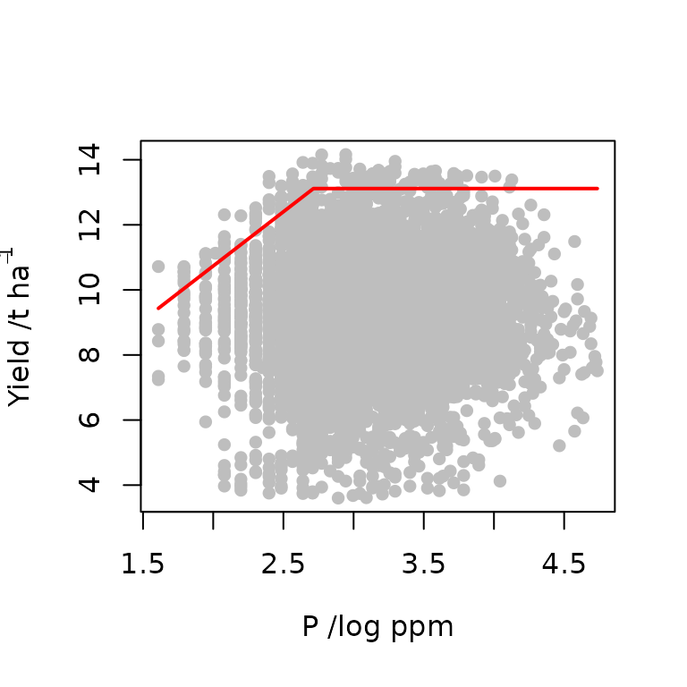
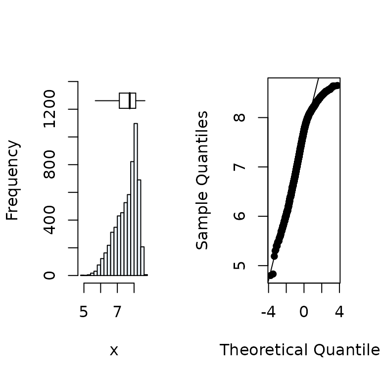
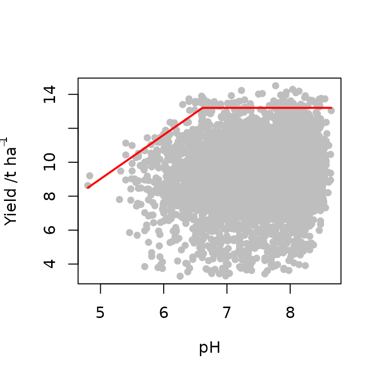

# Use of censored bivariate normal model function for yield gap analysis

## Introduction

The censored bivariate normal model (Lark and Milne, 2016) is a
statistical method to fit the boundary line to data. It fits the
boundary line using the maximum likelihood approach on a censored
bivariate distribution. This removes the subjectivity associated with
the other boundary line fitting methods ( bolides, Binning and quantile
regression) of selecting boundary points to which the boundary line is
fitted or specifying an arbitrary quantile to model. It also gives
evidence for the presence of boundary in a data set against a bivariate
normal null distribution. This method has been previously used to fit
boundary lines to data on nitrous oxide emission as a function of soil
moisture (Lark and Milne, 2016) and, wheat yield as a function of
nutrient concentration (Lark *et al.* 2020). An `R` package, `BLA`,
contains exploratory and boundary fitting functions that can be used in
the process of fitting a boundary line to data using the censored
bivariate normal model. This vignette gives a step by step process for
fitting the boundary line and subsequent post-hoc analysis. In this
demonstration, the data set `soil` will be used and boundary line
analysis will be carried out on soil P and pH.

## Load the BLA package

Load the `BLA` package using the
[`library()`](https://rdrr.io/r/base/library.html) function. In
addition, the `aplpack` package is also loaded. The `aplpack` package
contains the `bagplot()` function which is used to identify outliers in
a data set.

``` r
library(BLA)
```

``` r
library(aplpack)
```

## Yield gap analysis using boundary lines

The data that is going to be used for this is called the `soil`which is
part of the `BLA` package. It contains measures of wheat yield on farms
from different parts of the UK and its associated soil properties pH and
phosphorus. The process of yield gap analysis involves two step that
include (1) fitting the boundary line and (2) determining the most
limiting factor. We will first fit the boundary line to soil P and then
to pH after which the most limiting factor will be determined.

``` r
data("soil")
```

### Soil P boundary line fitting

#### Data exploration

Exploratory analysis is an essential initial step in fitting a boundary
line to data. This step ensures that the assumptions for the censored
bivariate normal model are met. Three exploratory procedures are
performed on the data which include (1) Assessing the plausibility of
normality of variables, (2) Removal of outliers, and (3) Testing for
evidence of boundary in the data.

1\. Assessing normality of independent and dependent variable

Boundary line model fitting using
[`cbvn()`](https://chawezimiti.github.io/BLA/reference/cbvn.md) requires
that the independent (*`x`*) and dependent (*`y`*) variables are
normally distributed albeit with censoring of the variable *`y`*. The
[`summastat()`](https://chawezimiti.github.io/BLA/reference/summastat.md)
function gives summary statistics of the distribution of a variable. The
octile skewness is a robust measure of skew, and we expect its absolute
value to be less than 0.2 for a normally distributed variable. We also
assess plots of the data, bearing in mind that the dependent variable
may be subject to censoring of large values under our target model.

``` r
x<-soil$P
y<-soil$yield

#Distribution of the x variable

summastat(x) 
```


    #>         Mean Median Quartile.1 Quartile.3 Variance       SD Skewness
    #> [1,] 25.9647     22         16         32 207.0066 14.38772 1.840844
    #>      Octile skewness Kurtosis No. outliers
    #> [1,]       0.3571429 5.765138           43

    summastat(log(x)) 


    #>          Mean   Median Quartile.1 Quartile.3  Variance        SD  Skewness
    #> [1,] 3.126361 3.091042   2.772589   3.465736 0.2556936 0.5056615 0.1297406
    #>      Octile skewness    Kurtosis No. outliers
    #> [1,]      0.08395839 -0.05372586            0

    x<-log(x) # since x required a transformation to assume it is from a normal distribution.

    #Distribution of the y variable

    summastat(y)


    #>          Mean  Median Quartile.1 Quartile.3 Variance       SD   Skewness
    #> [1,] 9.254813 9.36468   8.203703   10.39477 3.456026 1.859039 -0.4819805
    #>      Octile skewness Kurtosis No. outliers
    #> [1,]     -0.05793291 1.292635            7

2\. Removal of outliers

Boundary line analysis is sensitive to outlying values and hence it is
required that they are identified and removed. This can be done using
the `bagplot()` function of the `aplpack` package. The bag plot, a
bivariate box plot, has four main components, (1) a depth median
(equivalent to the median in a box plot) which is represents the centre
of the data set, (2) The bag which contains 50% of the data points
(eqiuavalent to the interquartile range), (3) a ‘fence’ that separates
probable outliers, (4) a loop which contains points outside the bag but
are not outliers.

``` r

# Create a dataframe containing x and y

df<-data.frame(x,y)

# Input the dataframe into the bagplot() function

bag<-bagplot(df,show.whiskers = FALSE, ylim=c(0,20),create.plot = FALSE)

# Combine data points from "bag" and within the loop i.e. exclude the outliers

dat<-rbind(bag$pxy.bag,bag$pxy.outer)

# Output is a matrix, we can pull out x and y variables for next stage 

x<-dat[,1] 
y<-dat[,2]
```

3\. Testing data for presence of boundary

If a boundary exists in a data set, it is expected that there will be
some clustering of observations at the upper edges of the data cloud
compared to a bivariate normally distributed data for which data points
at the upper edges are sparse because of the small probability density .
A boundary can be assumed in a data set if there is evidence of
clustering at the upper edges. The
[`expl_boundary()`](https://chawezimiti.github.io/BLA/reference/expl_boundary.md)
function, which is based on the convex hull, can be used to access
presence of boundary (Miti *et al*, 2024). This function checks
probability of the observed clustering if it came from a bivariate
normal distribution (p-value).

``` r

expl_boundary(x,y) # may take a few minutes to complete
```

From the results, the probability (*p*-value) of the having points close
to each other as in our data if it came from a bivariate normally
distributed data is less than 5%. Therefore, there is evidence of
bounding effects in the data in the right and left sections of the data.
Note that, in the plot, the data is split into right and left sections
to get more information on the clustering nature of points.

#### Fitting the boundary line to data

The exploratory tests indicated that the data provide evidence of a
boundary, outliers have been identified and removed, and the variables
*`x`* and *`y`* are normally distributed. We therefore proceed to fit a
boundary line model to the data set using the censored bivariate normal
model. The function
[`cbvn()`](https://chawezimiti.github.io/BLA/reference/cbvn.md) fits the
boundary line to the data. For more information about the arguments of
this function, check

``` r
?cbvn
```

Argument values for the function
[`cbvn()`](https://chawezimiti.github.io/BLA/reference/cbvn.md) need to
be set . Firstly, create a data-frame containing *`x`* and *`y`*, called
`data`.

``` r
data<-data.frame(x,y) #This is an input dataframe containing the variables
```

Secondly, the
[`cbvn()`](https://chawezimiti.github.io/BLA/reference/cbvn.md) requires
initial starting values, `start`, which are parameters of the boundary
line (the censor) and the bivariate normal distribution. Starting values
of the boundary line depend on the model that one wishes to fit to the
data (see options in
[`?cbvn`](https://chawezimiti.github.io/BLA/reference/cbvn.md)) . In
this case, we shall fit a linear+plateau model (lp) and hence the
parameters are the plateau value and the intercept and slope of the
linear component. The boundary line start values can be obtained using
the function
[`startValues()`](https://chawezimiti.github.io/BLA/reference/startValues.md).
For more information on the
[`startValues()`](https://chawezimiti.github.io/BLA/reference/startValues.md)
function run the code
[`?startValues`](https://chawezimiti.github.io/BLA/reference/startValues.md).
With a scatter plot of *`y`* against *`x`* active in the plot window in
`R`, run the function `start.values("lp")`, then click on the plot, the
point you expect to be the lowest and the largest response of a linear
model at the boundary. Note that starting values for other models can be
determined by changing the model name from “lp” to the desired models
(see
[`?startValues`](https://chawezimiti.github.io/BLA/reference/startValues.md)
help file).

``` r
plot(x,y)

startValues("lp") 
```

Next, determine the parameters of the bivariate normal distribution
which include the means of the *`x`* and *`y`* variables, standard
deviation of the *`x`* and *`y`* variables, and the correlation of *`x`*
and *`y`*.

``` r
mean(x) 
#> [1] 3.125969
mean(y) 
#> [1] 9.28862
sd(x) 
#> [1] 0.5005755
sd(y) 
#> [1] 1.728996
cor(x,y)
#> [1] 0.0346758

#The parameters of the boundary line and the data can be combined in a #vector start in the order 
#start<-c(intercept, slope, max response, mean(x), mean(y), sd(x), sd(y), cor(x,y))
```

Another important argument is the standard deviation of the measurement
error, `sigh`, of the response variable `y`. In some cases this might be
estimated from observations of analytical duplicates, or experiments to
determine measurement error for variables such as crop yield
(e.g. Kosmowski *et al*. 2021). However, in cases when this is not
available, it can be estimated using different options. One option of
estimation is to use a variogram if the location data for samples is
available. In that case, nugget variance which is the unexplained short
distance variations can be taken as an estimate of the measurement
error. If this is not possible, a profiling procedure can be done. This
is done by fitting a proposed model using a varied number of `sigh`
values while keeping the rest of the model parameters constant. The
log-likelihood values of the model for each `sigh` are determined and
the value that maximizes the likelihood can be selected from the
log-likelihood profile. This can be implemented using the
[`ble_profile()`](https://chawezimiti.github.io/BLA/reference/ble_profile.md)
function. For more information on this function run

``` r
?ble_profile
```

The possible `sigh` values can be set to 0.5, 0.7 and 0.8 and we can
check the likelihood profile.

``` r

sigh=c(0.5,0.7,0.8)
ble_profile(data,start,sigh,model = "lp") # may take a few minutes to run for large datasets
```

From the likelihood profile, the `sigh` that maximizes the likelihood is
around 0.65. We can use this for the value of `sigh`. Now that all the
arguments required for
[`cbvn()`](https://chawezimiti.github.io/BLA/reference/cbvn.md) function
are set, the boundary line can be fitted

``` r
start<-c(4,3,13.6,3,9,0.50,1.9,0.05)

model1<-cbvn(data,start=start,sigh=0.7,model = "lp", xlab=expression("P /log ppm"), ylab=expression("Yield /t ha"^{-1}), pch=16, col="grey")
```



``` r

model1
#> $Model
#> [1] "lp"
#> 
#> $Equation
#> [1] y = min (β₁ + β₂x, β₀)
#> 
#> $Parameters
#>          Estimate Standard error
#> β₁     4.06696830    1.062543187
#> β₂     3.33394003    0.483101081
#> β₀    13.11509466    0.162435745
#> mux    3.12596804    0.006451141
#> muy    9.29877801    0.022677786
#> sdx    0.50053541    0.004550540
#> sdy    1.60137534    0.018125877
#> rcorr  0.03013859    0.014294338
#> 
#> $AIC
#>             
#> mvn 32429.55
#> BL  32399.25
```

The boundary line is fitted and the parameters together with their
corresponding standard error values are obtained. However, there is one
question that needs to be addressed before we proceed,

Is the boundary line ideal for this data?

While fitting the BL model to the data, the
[`cbvn()`](https://chawezimiti.github.io/BLA/reference/cbvn.md) also
fits a bivariate normal model with no boundary and calculates it `AIC`
value. From our output, the `AIC` value of the BL model is lower than
that of the bivariate normal model. Therefore, the BL model is
appropriate. The parameters of the boundary line can now be used to
predict the boundary yield given the value of P.

The function
[`predictBL()`](https://chawezimiti.github.io/BLA/reference/predictBL.md)
in the BLA package can be used for this. For more information about the
function, see

``` r
?predictBL
```

We need to predict the largest expected yield for each point given the
soil P. We will replace any missing values with the mean value of P.

``` r

xp<-log(soil$P) # let xp be the P content in our dataset
xp[which(is.na(xp)==T)]<-mean(xp,na.rm=T)
P<-predictBL(model1,xp)
```

We can proceed to the next variable pH using the same procedure.

### Soil pH boundary line fitting

#### Data exploration

1\. Testing for normality of independent and dependent variable

``` r
x<-soil$pH
y<-soil$yield

# Distribution of the x variable

summastat(x) 
```



    #>          Mean Median Quartile.1 Quartile.3  Variance        SD   Skewness
    #> [1,] 7.566206   7.74       7.12        8.1 0.4344038 0.6590931 -0.7968046
    #>      Octile skewness    Kurtosis No. outliers
    #> [1,]      -0.3594771 -0.07912815            0

2\. Removal of outliers

``` r
 
# Create a dataframe of x and y which is an input into the bagplot() function

df<-data.frame(x,y) 

# Input the dataframe into the bagplot() function.

bag<-bagplot(df,show.whiskers = FALSE, ylim=c(0,20),create.plot = FALSE)

# Combine data points from "bag" and within the loop

dat<-rbind(bag$pxy.bag,bag$pxy.outer)

# Output is a matrix, we can pull out x and y variables for next stage 

x<-dat[,1] 
y<-dat[,2]
```

3\. Testing data for presence of boundary

This was already done using P and boundary existence was confirmed

#### Fitting the boundary line to data

From the exploratory tests, they indicated that the data provides
evidence of boundary existence, outliers have been identified and
removed, and the variables *`x`* and *`y`* are normally distributed. We
therefore, proceed to fit a boundary line model to the data set using
the censored bivariate normal model. The function
[`cbvn()`](https://chawezimiti.github.io/BLA/reference/cbvn.md) fits the
boundary line to the data.

We determine the argument values for the function
[`cbvn()`](https://chawezimiti.github.io/BLA/reference/cbvn.md) as
before . Firstly, create a data-frame containing *`x`* and *`y`,* called
`data`.

``` r
data<-data.frame(x,y) #This is an input dataframe containing the variables
```

Secondly, the
[`cbvn()`](https://chawezimiti.github.io/BLA/reference/cbvn.md) requires
initial starting values, *`start`*, which are parameters of the boundary
line (the censor) and the bivariate normal distribution. In this case,
we shall fit a linear+Plateau model (lp) and hence the parameters are
the plateau value and the intercept and slope of the linear component.
With a scatter plot of *`y`* against *`x`* active in the plot window in
`R`, run the function `start.values("lp")`, then click on the plot, the
point you expect to be the lowest and the largest response of a linear
model at the boundary. Note that starting values for other models can be
determined by changing the model name from “lp” to the desired models
(see
[`?startValues`](https://chawezimiti.github.io/BLA/reference/startValues.md)
help file)

``` r
plot(x,y)

startValues("lp") 
```

Next, determine the parameters of the bivariate normal distribution
which include the means of the *`x`* and *`y`* variables, standard
deviation of the *`x`* and *`y`* variables, and the correlation of *`x`*
and *`y`*.

``` r
mean(x) 
#> [1] 7.569203
mean(y) 
#> [1] 9.277917
sd(x) 
#> [1] 0.656315
sd(y) 
#> [1] 1.755941
cor(x,y)
#> [1] 0.1169399

#The parameters of the boundary line and the data can be combined in a #vector start in the order 
#start<-c(intercept, slope, max response, mean(x), mean(y), sd(x), sd(y), cor(x,y))

start<-c(-9,3, 13.5,7.5,9,0.68,2.3,0.12)
```

The standard deviation of the measurement error, *`sigh`* was already
determine as 0.7. Now that all the arguments required for
[`cbvn()`](https://chawezimiti.github.io/BLA/reference/cbvn.md) function
are set, the boundary line can be fitted

``` r

model2<-cbvn(data,start=start,sigh=0.7,model = "lp", xlab=expression("pH"), ylab=expression("Yield /t ha"^{-1}), pch=16, col="grey")
```



``` r

model2
#> $Model
#> [1] "lp"
#> 
#> $Equation
#> [1] y = min (β₁ + β₂x, β₀)
#> 
#> $Parameters
#>         Estimate Standard error
#> β₁    -3.9496784    0.625843951
#> β₂     2.5933540    0.107681571
#> β₀    13.2048773    0.173877733
#> mux    7.5692058    0.008439500
#> muy    9.2839579    0.022826649
#> sdx    0.6562763    0.005967654
#> sdy    1.6239692    0.018077098
#> rcorr  0.1233113    0.014184125
#> 
#> $AIC
#>             
#> mvn 35962.04
#> BL  35946.16
```

The boundary line is fitted and the parameters together with their
corresponding standard error values are obtained. From our output, the
`AIC` value of the BL model is lower than that of the bivariate normal
model. Therefore, the BL model is appropriate. The parameters of the
boundary line can now be used to predict the boundary yield given the
value of pH using the function
[`predictBL()`](https://chawezimiti.github.io/BLA/reference/predictBL.md).
We need to predict the largest expected yield for each farm given the
soil pH. We will replace any missing values with the mean value of pH.

``` r

xpH<-soil$pH # let xpH be the P content in our dataset
xpH[which(is.na(xpH)==T)]<-mean(xpH,na.rm=T)
pH<-predictBL(model2,xpH)
```

### Determination of most limiting factor

The boundary line analysis has been used to determine the most limiting
factor in many yield gap analysis studies. This is according to the von
Liebig (1840) law of the minimum

\$\$ y={\rm min}(f_1(x_1),f_2(x_2),...,f_n(x_n)) \$\$

In the BLA package, the function
[`limfactor()`](https://chawezimiti.github.io/BLA/reference/limfactor.md)
can be used to determine the most limiting factor at each point. For
more information on the function, see

``` r
?limfactor
```

For the two soil properties in our dataset, the most limiting factor for
each data point is determined as

``` r

Limiting_factor<-limfactor(P,pH) # This produces a list of length 2 containg a vector limiting factors at each pont and the maximum predicted response in the dataset.

Limiting_factors<-Limiting_factor[[1]] 
```

We can check the proportion of cases in which each of the soil
properties was limiting

``` r
Lim_factors<-Limiting_factors$Lim_factor

barplot(prop.table(table(Lim_factors))*100,
        ylab = "Percentage (%)",
        xlab = "Soil property",
        col = "grey",
        ylim=c(0,90))

axis(side = 1, at = seq(0, 4, by = 1), labels = FALSE, lwd = 1, col.ticks = "white")  
axis(side = 2, lwd = 1)  
```


As only two factors were evaluated, most of the yield gap cause was
unidentified. This is because there many other factors affecting yield
which we did not consider in this case. You can also plot the predicted
yield by the most limiting factor against the actual yield.

``` r

plot(Limiting_factors$Rs, soil$yield,
     xlab="Predicted yield (ton/ha)",
     ylab="Actual yield (ton/ha)", pch=16, col="grey")

abline(h=Limiting_factor[[2]], col="blue", lty=5, lwd=1)
lines(c(min(Limiting_factors$Rs),max(Limiting_factors$Rs)), 
c(min(Limiting_factors$Rs),max(Limiting_factors$Rs)), 
col="red", lwd=2)

legend("bottomleft",legend = c("Att yield", "1:1 line"),
       lty=c(5,1), col=c("blue", "red"), lwd=c(1, 2), cex = 0.8)
```


The dashed blue line represents the attainable yield for this particular
setting. The 1:1 describes the situations in which the actual yield is
equal to the predicted yield by the most limiting factor. The yield gap
for each point is equivalent to the vertical distance between the point
and the 1:1 line. The points above the 1:1 line are considered to have
zero yield gap and their position above the line is only due to
measurement error.

### Concluding remarks

The censored bivariate normal model has been used to carry out a yield
gap analysis. The advantage of using this method over the other boundary
line fitting methods is that it is based on statistical principles and
it removes the subjectivity associated with selection of bin sizes and
the quantile to consider as boundary as it is done in the binning
methodology and quantile regression. Furthermore, the uncertainty around
the boundary line can also be determined.

## References

1.  Kosmowski, F., Chamberlin, J., Ayalew, H., Sida, T., Abay, K., &
    Craufurd, P. (2021). How accurate are yield estimates from crop
    cuts? evidence from small-holder maize farms in ethiopia. Food
    Policy, 102 , 102122.
    <https://doi.org/10.1016/j.foodpol.2021.102122>

2.  Lark, R. M., Gillingham, V., Langton, D., & Marchant, B. P. (2020).
    Boundary line models for soil nutrient concentrations and wheat
    yield in national-scale datasets.European Journal of Soil Science,
    71 , 334-351. <https://doi.org/10.1111/ejss.12891>

3.  Lark, R. M., & Milne, A. E. (2016). Boundary line analysis of the
    effect of water filled pore space on nitrous oxide emission from
    cores of arable soil. European Journal of Soil Science, 67 ,
    148-159. <https://doi.org/10.1111/ejss.12318>

4.  Milne, A. E., Wheeler, H. C., & Lark, R. M. (2006). On testing
    biological data for the presence of a boundary. Annals of Applied
    Biology, 149 , 213-222.
    <https://doi.org/10.1111/j.1744-7348.2006.00085.x>

5.  Miti, C., Milne, A., Giller, K., Sadras, V., & Lark, R. (2024).
    Exploration of data for analysis using boundary line methodology.
    Computers and Electronics in Agriculture, 219.
    <https://doi.org/10.1016/j.compag.2024.108794>
